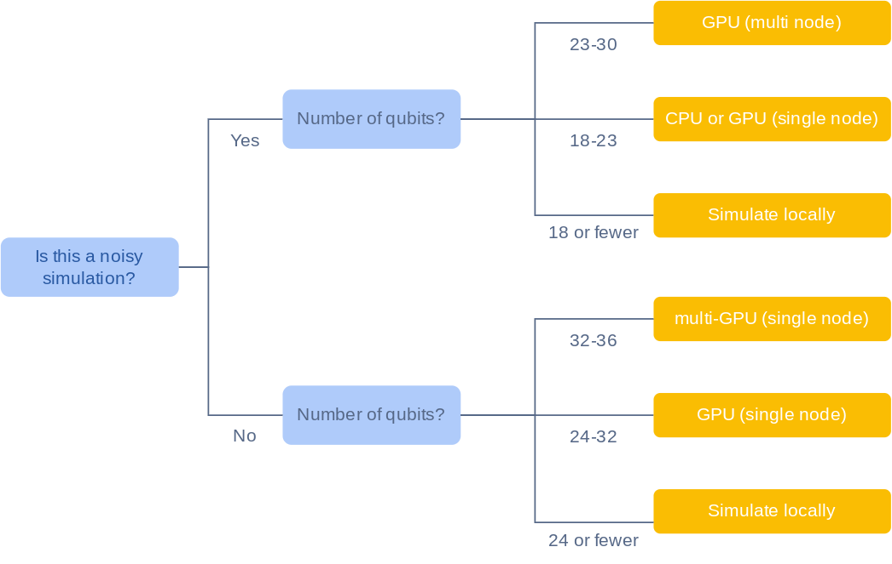
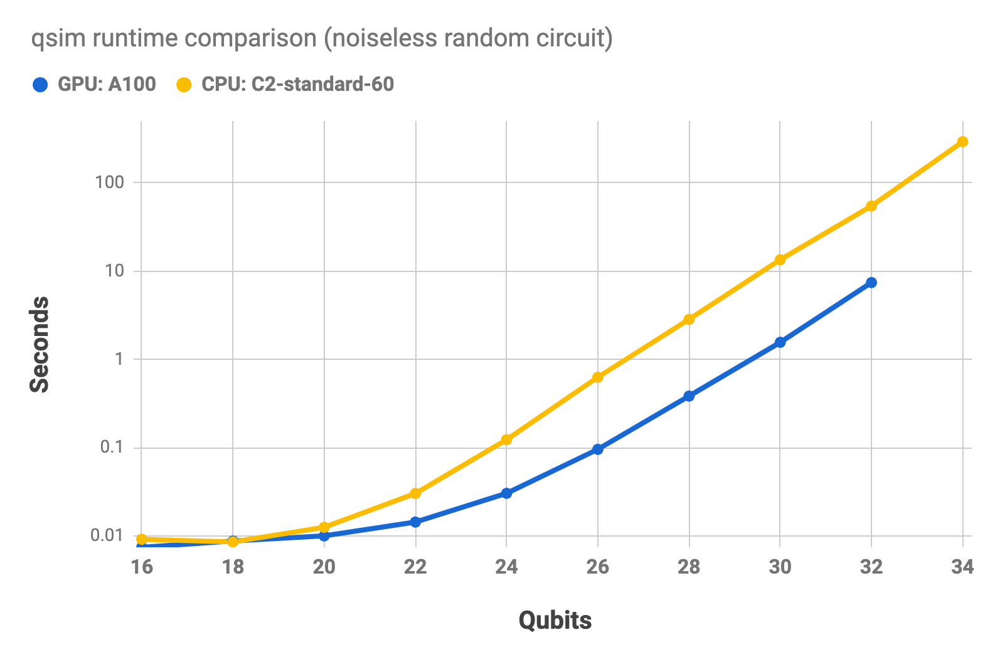
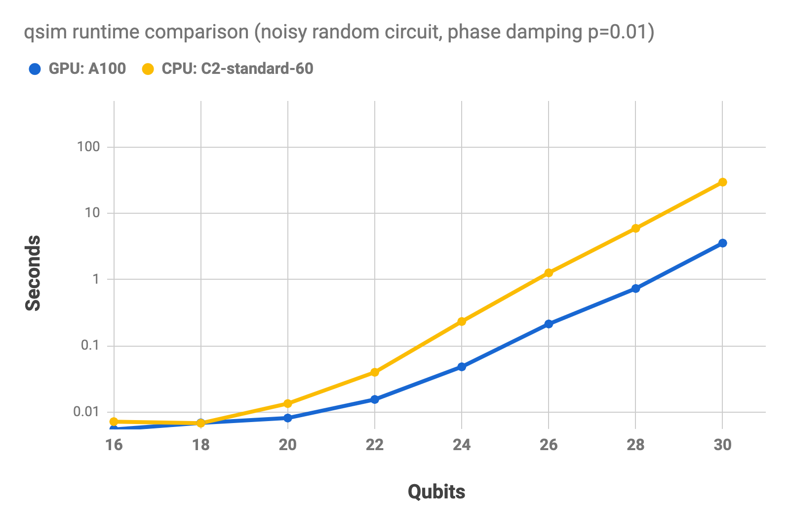

<devsite-mathjax config="TeX-AMS-MML_SVG"></devsite-mathjax>

# Choosing hardware for your qsim simulation

As you increase the size and complexity of your quantum simulation, you rapidly
require a large increase in computational power. This guide describes
considerations that can help you choose hardware for your simulation.

Your simulation setup depends on the following:

*   Noise; noisy (realistic) simulations require more compute power than
    noiseless (idealised) simulations.
*   Number of qubits.
*   Circuit depth; the number of time steps required to perform the circuit.

## Quick start

The following graph provides loose guidelines to help you get started with
choosing hardware for your simulation. The qubit upper bounds in this chart are
not technical limits.

## Choose hardware for your simulation

### 1. Evaluate whether your simulation can be run locally

If you have a modern laptop with at least 8GB of memory, you can run your
simulation locally in the following cases:

*   Noiseless simulations that use fewer than 29 qubits.
*   Noisy simulations that use fewer than 18 qubits.

If you intend to simulate a circuit many times, consider multinode simulation.
For more information about multinode simulation [see step 5,
below](#5_consider_multiple_compute_nodes).

### 2. Estimate your memory requirements

You can estimate your memory requirements with the following rule of thumb:
${\rm memory\ required} = 8 \cdot 2^N \  {\rm bytes}$ for an N-qubit circuit

In addition to memory size, consider the bandwidth of your memory. qsim performs
best when it can use the maximum number of threads. Multi-threaded simulation
benefits from high-bandwidth memory (above 100GB/s).

### 3. Decide among CPUs, single GPUs, or multiple GPUs

*   GPU hardware starts to outperform CPU hardware significantly (up to 15x
    faster) for circuits with more than 20 qubits.
*   The maximum number of qubits that you can simulate with a GPU is limited by
    the memory of the GPU. For example, for a noiseless simulation on an NVIDIA
    A100 GPU with 40GB of memory, the maximum number of qubits is 32.
*   However, if you have access to a device with multiple GPUs, you can
    pool their memory. For example, with eight 80-GB NVIDIA A100 GPUs (640GB of
    total GPU memory), you can simulate up to 36 qubits. Multi-GPU simulations
    are supported by [NVIDIA's cuQuantum Appliance](https://catalog.ngc.nvidia.com/orgs/nvidia/containers/cuquantum-appliance),
    which acts as a backend for qsim.

The following charts show the runtime for a random circuit run on
[Google Compute Engine](https://cloud.google.com/compute), using an NVIDIA A100
GPU, and a compute-optimized CPU (c2-standard-4). The first chart shows the
runtimes for the noiseless simulation. The second chart shows the runtimes for a
noisy simulation, using a phase damping channel (p=0.01). The charts use a log
scale. These benchmarks were all performed using qsim's native GPU and CPU
backends and do not involve sampling bitstrings (i.e. no measure gates).

### 4. If using GPUs, select a backend

For GPU-based simulations, you can either use qsim's native GPU backend
or the NVIDIA cuQuantum backend. While the native qsim GPU backend is performant
for extracting amplitudes of specific quantum states, it is not optimized for
sampling bitstrings, i.e. for simulating circuits that have measurement gates. For
that purpose, cuQuantum performs significantly better. cuQuantum is also needed
for multi-GPU support. More specifically, there are three options for GPU-based
simulations:
1.  Native qsim. This option involves compiling qsim locally with the CUDA toolkit
    installed, as described [here](tutorials/gcp_gpu).
2.  NVIDIA cuQuantum SDK/cuStateVec. This option involves installing [NVIDIA's cuQuantum SDK](https://developer.nvidia.com/cuquantum-sdk)
    (instructions [here](https://docs.nvidia.com/cuda/cuquantum/custatevec/getting_started.html#installation-and-compilation)),
    setting the `CUQUANTUM_ROOT` environment variable and then compiling qsim locally.
    See further instructions [here](tutorials/gcp_gpu#optional-use-the-nvidia-cuquantum-sdk).
    This allows you to use the cuQuantum backend with the latest version of qsim.
    However, it does not enable multi-GPU support.
3.  For multi-GPU support, you will need to use [cuQuantum Appliance](https://catalog.ngc.nvidia.com/orgs/nvidia/containers/cuquantum-appliance),
    which runs in a Docker container and contains a version of qsim that has been
    slightly modified by NVIDIA. The versions of qsim and cirq in this container
    may be out of date.

We recommend option 2 if you are not planning to run multi-GPU simulations
and option 3 if you are.

Note the settings in [`qsimcirq.QSimOptions`](https://quantumai.google/reference/python/qsimcirq/QSimOptions),
which allow you to specify the GPU backend as well as related settings. We find
that `max_fused_gate_size = 4` is usually optimal for larger circuits, although you may want to experiment yourself.
In cuQuantum Appliance, these settings are extended, as documented [here](https://docs.nvidia.com/cuda/cuquantum/appliance/cirq.html),
allowing you to specify how many and which GPUs to use.

### 5. Select a specific machine

After you decide whether you want to use CPUs or GPUs for your simulation,
choose a specific machine:

#### For CPU-based simulations:

1.  Restrict your options to machines that meet your memory requirements. For
    more information about memory requirements, see step 2.
2.  Decide if performance (speed) or cost is more important to you:
    *   For a table of performance benchmarks, see
        [Sample benchmarks](#sample_benchmarks) below.
    *   For more information about GCP pricing, see the
        [Google Cloud pricing calculator](https://cloud.google.com/products/calculator).
    *   Prioritizing performance is particularly important in the following
        scenarios:
        *   Simulating with a **higher f value** (f is the maximum number of
            qubits allowed per fused gate).
            *   For small to medium size circuits (up to 22 qubits), keep f low
                (2 or 3).
            *   For medium to large size qubits (22+ qubits), use a higher f
                typically, f=4 is the best option).
        *   Simulating a **deep circuit** (depth 30+).

#### For GPU-based simulations:

For GPU simulations, you may follow the instructions in [this](tutorials/gcp_gpu)
guide to set up a virtual machine (VM) on Google Cloud Platform (GCP).
Alternatively, you can use your own hardware.
Note the [hardware requirements](https://docs.nvidia.com/cuda/cuquantum/getting_started.html#custatevec)
for NVIDIA's cuQuantum when picking a GPU; in particular, it must have
CUDA Compute Capability 7.0 or higher.
At the time of writing, the following compatable GPUs are available on GCP:
*    [NVIDIA T4](https://www.techpowerup.com/gpu-specs/tesla-t4.c3316).
     This is the least expensive compatable GPU on GCP.
     It has 16GB of memory and can therefore simulate up to 30 qubits.
     It is not compatible with multi-GPU simulations.
*    [NVIDIA V100](https://www.techpowerup.com/gpu-specs/tesla-v100-pcie-16-gb.c2957).
     Like the NVIDIA T4, this GPU has 16GB of RAM and
     therefore supports up to 30 qubits. It is faster than the T4.
     Further, it is compatible with multi-GPU simulations. With 8 NVIDIA V100s (128GB),
     you can simulate up to 33 qubits.
*    [NVIDIA L4](https://www.techpowerup.com/gpu-specs/l4.c4091). This GPU has 24GB
     of RAM and can therefore simulate up to 31 qubits. With eight of them (192GB), you can simulate
     up to 34 qubits.
*    [NVIDIA A100 (40GB)](https://www.techpowerup.com/gpu-specs/a100-pcie-40-gb.c3623).
     Can simulate 32 qubits with a single GPU or 36 qubits with 16 GPUS (640GB).
*    [NVIDIA A100 (80GB)](https://www.techpowerup.com/gpu-specs/a100-pcie-80-gb.c3821).
     Can simulate 33 qubits with a single GPU or 36 with 8 GPUs (640GB).

If you are using GCP, pay attention to the hourly cost, which you can see when creating a VM. To estimate
your total cost, you need to know how long your simulation will take to run. Here
are our benchmarks of the various GPUs (except the L4, which was added after we performed
the benchmarks). We report the time in seconds to run a noiseless depth-N circuit on N qubits and
sample 100,000 N-bit bitstrings, all benchmarked using cuQuantum with `max_fused_gate_size = 4`.

<table>
    <thead>
      <tr>
        <th rowspan=2>GPU</th>
        <th rowspan=2>number of GPUs</th>
        <th colspan=6>
          Runtime using cuQuantum (seconds)
         </th>
      </tr>
      <tr>
        <th>N=26</th>
        <th>N=28</th>
        <th>N=30</th>
        <th>N=32</th>
        <th>N=34</th>
        <th>N=36</th>
        </tr>
    </thead>
    <tbody>
        <tr>
            <td>NVIDIA T4</td>
            <td>1</td>
            <td>1.25</td>
           <td>3.5</td>
            <td>13.4</td>
             <td>insufficient RAM</td>
           <td>insufficient RAM</td>
            <td>insufficient RAM</td>
        </tr>
        <tr>
            <td>NVIDIA V100</td>
            <td>1</td>
            <td>0.91</td>
           <td>1.55</td>
            <td>4.4</td>
             <td>insufficient RAM</td>
           <td>insufficient RAM</td>
            <td>insufficient RAM</td>
        </tr>
        <tr>
            <td>NVIDIA V100</td>
            <td>2</td>
            <td>1.0</td>
           <td>1.3</td>
            <td>2.5</td>
             <td>insufficient RAM</td>
           <td>insufficient RAM</td>
            <td>insufficient RAM</td>
        </tr>
        <tr>
            <td>NVIDIA A100 (40GB)</td>
            <td>1</td>
            <td>0.89</td>
           <td>1.23</td>
            <td>2.95</td>
             <td>11.1</td>
           <td>insufficient RAM</td>
            <td>insufficient RAM</td>
        </tr>
                <tr>
            <td>NVIDIA A100 (40GB)</td>
            <td>2</td>
            <td>1.04</td>
           <td>1.24</td>
            <td>1.88</td>
             <td>4.85</td>
           <td>insufficient RAM</td>
            <td>insufficient RAM</td>
        </tr>
            <tr>
            <td>NVIDIA A100 (80GB)</td>
            <td>2</td>
            <td>1.04</td>
           <td>1.21</td>
            <td>1.75</td>
             <td>4.06</td>
           <td>14.6</td>
            <td>insufficient RAM</td>
        </tr>
        </tr>
            <tr>
            <td>NVIDIA A100 (80GB)</td>
            <td>8</td>
            <td>1.31</td>
           <td>1.38</td>
            <td>1.55</td>
             <td>2.23</td>
           <td>5.09</td>
            <td>17.6</td>
        </tr>
    </tbody>
</table>
    

### 6. Consider multiple compute nodes

Simulating in multinode mode is useful when your simulation can be parallelized.
In a noisy simulation, the trajectories (also known as repetitions, iterations)
are “embarrassingly parallelizable”, there is an automated workflow for
distributing these trajectories over multiple nodes. A simulation of many
noiseless circuits can also be distributed over multiple compute nodes.

For more information about running a mulitnode simulation, see [Multinode quantum
simulation using HTCondor on Google Cloud](/qsim/tutorials/multinode).

## Runtime estimates

Runtime grows exponentially with the number of qubits, and linearly with circuit
depth beyond 20 qubits.

*   For noiseless simulations, runtime grows at a rate of $2^N$ for an N-qubit
    circuit. For more information about runtimes for small circuits, see
    [Additional notes for advanced users](#additional_notes_for_advanced_users)
    below).
*   For noisy simulations, runtime grows at a rate of $2^N$ multiplied by the
    number of iterations for an N-qubit circuit.

## Additional notes for advanced users

*   The impact of noise on simulation depends on:
    *   What type of errors are included in your noise channel (decoherence,
        depolarizing channels, coherent errors, readout errors).
    *   How you can represent your noise model using Kraus operator formalism:
        *   Performance is best in the case where all Kraus operators are
            proportional to unitary matrices, such as when using only a
            depolarizing channel.
        *   Using noise which cannot be represented with Kraus operators
            proportional to unitary matrices, can slow down simulations by a
            factor of up to 6** **compared to using a depolarizing channel only
        *   Noisy simulations are faster with lower noise (when one Kraus
            operator dominates).
*   Experimenting with the 'f' parameter (maximum number of qubits allowed per
    fused gate):
    *   The advanced user is advised to try out multiple f values to optimize
        their simulation setup.
        *   Note that f=2 or f=3 can be optimal for large circuits simulated on
            CPUs with a smaller number of threads (say, up to four or eight
            threads). However, this depends on the circuit structure.
        *   Note that f=6 is very rarely optimal.
*   Using the optimal number of threads:
    *   Use the maximum number of threads on CPUs for the best performance.
    *   If the maximum number of threads is not used on multi-socket machines
        then it is advisable to distribute threads evenly to all sockets or to
        run all threads within a single socket. Separate simulations on each
        socket can be run simultaneously in the latter case.
    *   Note that currently the number of CPU threads does not affect the
        performance for small circuits (smaller than 17 qubits). Only one thread
        is used because of OpenMP overhead.
*   Runtime estimates for small circuits:
    *   For circuits that contain fewer than 20 qubits, the qsimcirq translation
        layer performance overhead tends to dominate the runtime estimate. In
        addition to this, qsim is not optimized for small circuits.
    *   The total small circuits runtime overhead for an N qubit circuit
        depends on the circuit depth and on N. The overhead can be large enough to
        conceal the  $2^N$ growth in runtime.

## Sample benchmarks

The following benchmarks are all run using qsim's native CPU and GPU backends
and do not involve sampling bitstrings.

**Noiseless simulation benchmarks data sheet**

For a random circuit, depth=20, f=3, max threads.

<table>
  <tr>
   <td style="background-color: null"><strong>processor type</strong>
   </td>
   <td style="background-color: null"><strong>machine</strong>
   </td>
   <td style="background-color: null"><strong># of qubits</strong>
   </td>
   <td style="background-color: null"><strong>runtime</strong>
   </td>
  </tr>
  <tr>
   <td style="background-color: #f3f3f3">CPU
   </td>
   <td style="background-color: #f3f3f3">c2-standard-60
   </td>
   <td style="background-color: #f3f3f3">34
   </td>
   <td style="background-color: #f3f3f3">291.987
   </td>
  </tr>
  <tr>
   <td style="background-color: #f3f3f3">CPU
   </td>
   <td style="background-color: #f3f3f3">c2-standard-60
   </td>
   <td style="background-color: #f3f3f3">32
   </td>
   <td style="background-color: #f3f3f3">54.558
   </td>
  </tr>
  <tr>
   <td style="background-color: #f3f3f3">CPU
   </td>
   <td style="background-color: #f3f3f3">c2-standard-60
   </td>
   <td style="background-color: #f3f3f3">30
   </td>
   <td style="background-color: #f3f3f3">13.455
   </td>
  </tr>
  <tr>
   <td style="background-color: #f3f3f3">CPU
   </td>
   <td style="background-color: #f3f3f3">c2-standard-60
   </td>
   <td style="background-color: #f3f3f3">28
   </td>
   <td style="background-color: #f3f3f3">2.837
   </td>
  </tr>
  <tr>
   <td style="background-color: #f3f3f3">CPU
   </td>
   <td style="background-color: #f3f3f3">c2-standard-60
   </td>
   <td style="background-color: #f3f3f3">24
   </td>
   <td style="background-color: #f3f3f3">0.123
   </td>
  </tr>
  <tr>
   <td style="background-color: #f3f3f3">CPU
   </td>
   <td style="background-color: #f3f3f3">c2-standard-60
   </td>
   <td style="background-color: #f3f3f3">20
   </td>
   <td style="background-color: #f3f3f3">0.013
   </td>
  </tr>
  <tr>
   <td style="background-color: #f3f3f3">CPU
   </td>
   <td style="background-color: #f3f3f3">c2-standard-60
   </td>
   <td style="background-color: #f3f3f3">16
   </td>
   <td style="background-color: #f3f3f3">0.009
   </td>
  </tr>
  <tr>
   <td style="background-color: #ffffff">CPU
   </td>
   <td style="background-color: null">c2-standard-4-4
   </td>
   <td style="background-color: null">30
   </td>
   <td style="background-color: null">52.880
   </td>
  </tr>
  <tr>
   <td style="background-color: #ffffff">CPU
   </td>
   <td style="background-color: null">c2-standard-4-4
   </td>
   <td style="background-color: null">28
   </td>
   <td style="background-color: null">12.814
   </td>
  </tr>
  <tr>
   <td style="background-color: #ffffff">CPU
   </td>
   <td style="background-color: null">c2-standard-4-4
   </td>
   <td style="background-color: null">24
   </td>
   <td style="background-color: null">0.658
   </td>
  </tr>
  <tr>
   <td style="background-color: #ffffff">CPU
   </td>
   <td style="background-color: null">c2-standard-4-4
   </td>
   <td style="background-color: null">20
   </td>
   <td style="background-color: null">0.031
   </td>
  </tr>
  <tr>
   <td style="background-color: #ffffff">CPU
   </td>
   <td style="background-color: null">c2-standard-4-4
   </td>
   <td style="background-color: null">16
   </td>
   <td style="background-color: null">0.008
   </td>
  </tr>
  <tr>
   <td style="background-color: #f3f3f3">GPU
   </td>
   <td style="background-color: #f3f3f3">a100
   </td>
   <td style="background-color: #f3f3f3">32
   </td>
   <td style="background-color: #f3f3f3">7.415
   </td>
  </tr>
  <tr>
   <td style="background-color: #f3f3f3">GPU
   </td>
   <td style="background-color: #f3f3f3">a100
   </td>
   <td style="background-color: #f3f3f3">30
   </td>
   <td style="background-color: #f3f3f3">1.561
   </td>
  </tr>
  <tr>
   <td style="background-color: #f3f3f3">GPU
   </td>
   <td style="background-color: #f3f3f3">a100
   </td>
   <td style="background-color: #f3f3f3">28
   </td>
   <td style="background-color: #f3f3f3">0.384
   </td>
  </tr>
  <tr>
   <td style="background-color: #f3f3f3">GPU
   </td>
   <td style="background-color: #f3f3f3">a100
   </td>
   <td style="background-color: #f3f3f3">24
   </td>
   <td style="background-color: #f3f3f3">0.030
   </td>
  </tr>
  <tr>
   <td style="background-color: #f3f3f3">GPU
   </td>
   <td style="background-color: #f3f3f3">a100
   </td>
   <td style="background-color: #f3f3f3">20
   </td>
   <td style="background-color: #f3f3f3">0.010
   </td>
  </tr>
  <tr>
   <td style="background-color: #f3f3f3">GPU
   </td>
   <td style="background-color: #f3f3f3">a100
   </td>
   <td style="background-color: #f3f3f3">16
   </td>
   <td style="background-color: #f3f3f3">0.007
   </td>
  </tr>
  <tr>
   <td style="background-color: #f3f3f3">GPU
   </td>
   <td style="background-color: #f3f3f3">t4
   </td>
   <td style="background-color: #f3f3f3">30
   </td>
   <td style="background-color: #f3f3f3">10.163
   </td>
  </tr>
  <tr>
   <td style="background-color: null">GPU
   </td>
   <td style="background-color: null">t4
   </td>
   <td style="background-color: null">28
   </td>
   <td style="background-color: null">2.394
   </td>
  </tr>
  <tr>
   <td style="background-color: null">GPU
   </td>
   <td style="background-color: null">t4
   </td>
   <td style="background-color: null">24
   </td>
   <td style="background-color: null">0.118
   </td>
  </tr>
  <tr>
   <td style="background-color: null">GPU
   </td>
   <td style="background-color: null">t4
   </td>
   <td style="background-color: null">20
   </td>
   <td style="background-color: null">0.014
   </td>
  </tr>
  <tr>
   <td style="background-color: null">GPU
   </td>
   <td style="background-color: null">t4
   </td>
   <td style="background-color: null">16
   </td>
   <td style="background-color: null">0.007
   </td>
  </tr>
</table>

**Noisy simulation benchmarks data sheet**

For one trajectory of a random circuit, depth=20, f=3, max threads.

<table>
  <tr>
   <td style="background-color: null"><strong>processor type</strong>
   </td>
   <td style="background-color: null"><strong>machine</strong>
   </td>
   <td style="background-color: null"><strong>noise type</strong>
   </td>
   <td style="background-color: null"><strong># of qubits</strong>
   </td>
   <td style="background-color: null"><strong>runtime</strong>
   </td>
  </tr>
  <tr>
   <td style="background-color: #f3f3f3">CPU
   </td>
   <td style="background-color: #f3f3f3">c2-standard-60
   </td>
   <td style="background-color: #f3f3f3">depolarizing
   </td>
   <td style="background-color: #f3f3f3">30
   </td>
   <td style="background-color: #f3f3f3">13.021
   </td>
  </tr>
  <tr>
   <td style="background-color: #f3f3f3">CPU
   </td>
   <td style="background-color: #f3f3f3">c2-standard-60
   </td>
   <td style="background-color: #f3f3f3">depolarizing
   </td>
   <td style="background-color: #f3f3f3">28
   </td>
   <td style="background-color: #f3f3f3">2.840
   </td>
  </tr>
  <tr>
   <td style="background-color: #f3f3f3">CPU
   </td>
   <td style="background-color: #f3f3f3">c2-standard-60
   </td>
   <td style="background-color: #f3f3f3">depolarizing
   </td>
   <td style="background-color: #f3f3f3">26
   </td>
   <td style="background-color: #f3f3f3">0.604
   </td>
  </tr>
  <tr>
   <td style="background-color: #f3f3f3">CPU
   </td>
   <td style="background-color: #f3f3f3">c2-standard-60
   </td>
   <td style="background-color: #f3f3f3">depolarizing
   </td>
   <td style="background-color: #f3f3f3">24
   </td>
   <td style="background-color: #f3f3f3">0.110
   </td>
  </tr>
  <tr>
   <td style="background-color: #f3f3f3">CPU
   </td>
   <td style="background-color: #f3f3f3">c2-standard-60
   </td>
   <td style="background-color: #f3f3f3">depolarizing
   </td>
   <td style="background-color: #f3f3f3">20
   </td>
   <td style="background-color: #f3f3f3">0.009
   </td>
  </tr>
  <tr>
   <td style="background-color: #f3f3f3">CPU
   </td>
   <td style="background-color: #f3f3f3">c2-standard-60
   </td>
   <td style="background-color: #f3f3f3">depolarizing
   </td>
   <td style="background-color: #f3f3f3">16
   </td>
   <td style="background-color: #f3f3f3">0.006
   </td>
  </tr>
  <tr>
   <td style="background-color: #f3f3f3">CPU
   </td>
   <td style="background-color: #f3f3f3">c2-standard-60
   </td>
   <td style="background-color: #f3f3f3">dephasing
   </td>
   <td style="background-color: #f3f3f3">30
   </td>
   <td style="background-color: #f3f3f3">122.788
   </td>
  </tr>
  <tr>
   <td style="background-color: #f3f3f3">CPU
   </td>
   <td style="background-color: #f3f3f3">c2-standard-60
   </td>
   <td style="background-color: #f3f3f3">dephasing
   </td>
   <td style="background-color: #f3f3f3">28
   </td>
   <td style="background-color: #f3f3f3">29.966
   </td>
  </tr>
  <tr>
   <td style="background-color: #f3f3f3">CPU
   </td>
   <td style="background-color: #f3f3f3">c2-standard-60
   </td>
   <td style="background-color: #f3f3f3">dephasing
   </td>
   <td style="background-color: #f3f3f3">26
   </td>
   <td style="background-color: #f3f3f3">6.378
   </td>
  </tr>
  <tr>
   <td style="background-color: #f3f3f3">CPU
   </td>
   <td style="background-color: #f3f3f3">c2-standard-60
   </td>
   <td style="background-color: #f3f3f3">dephasing
   </td>
   <td style="background-color: #f3f3f3">24
   </td>
   <td style="background-color: #f3f3f3">1.181
   </td>
  </tr>
  <tr>
   <td style="background-color: #f3f3f3">CPU
   </td>
   <td style="background-color: #f3f3f3">c2-standard-60
   </td>
   <td style="background-color: #f3f3f3">dephasing
   </td>
   <td style="background-color: #f3f3f3">20
   </td>
   <td style="background-color: #f3f3f3">0.045
   </td>
  </tr>
  <tr>
   <td style="background-color: #f3f3f3">CPU
   </td>
   <td style="background-color: #f3f3f3">c2-standard-60
   </td>
   <td style="background-color: #f3f3f3">dephasing
   </td>
   <td style="background-color: #f3f3f3">16
   </td>
   <td style="background-color: #f3f3f3">0.023
   </td>
  </tr>
  <tr>
   <td style="background-color: #ffffff">CPU
   </td>
   <td style="background-color: #ffffff">c2-standard-4-4
   </td>
   <td style="background-color: null">depolarizing
   </td>
   <td style="background-color: #ffffff">26
   </td>
   <td style="background-color: #ffffff">2.807
   </td>
  </tr>
  <tr>
   <td style="background-color: null">CPU
   </td>
   <td style="background-color: null">c2-standard-4-4
   </td>
   <td style="background-color: null">depolarizing
   </td>
   <td style="background-color: null">24
   </td>
   <td style="background-color: null">0.631
   </td>
  </tr>
  <tr>
   <td style="background-color: null">CPU
   </td>
   <td style="background-color: null">c2-standard-4-4
   </td>
   <td style="background-color: null">depolarizing
   </td>
   <td style="background-color: null">20
   </td>
   <td style="background-color: null">0.027
   </td>
  </tr>
  <tr>
   <td style="background-color: null">CPU
   </td>
   <td style="background-color: null">c2-standard-4-4
   </td>
   <td style="background-color: null">depolarizing
   </td>
   <td style="background-color: null">16
   </td>
   <td style="background-color: null">0.005
   </td>
  </tr>
  <tr>
   <td style="background-color: null">CPU
   </td>
   <td style="background-color: null">c2-standard-4-4
   </td>
   <td style="background-color: null">dephasing
   </td>
   <td style="background-color: null">26
   </td>
   <td style="background-color: null">33.038
   </td>
  </tr>
  <tr>
   <td style="background-color: null">CPU
   </td>
   <td style="background-color: null">c2-standard-4-4
   </td>
   <td style="background-color: null">dephasing
   </td>
   <td style="background-color: null">24
   </td>
   <td style="background-color: null">7.432
   </td>
  </tr>
  <tr>
   <td style="background-color: null">CPU
   </td>
   <td style="background-color: null">c2-standard-4-4
   </td>
   <td style="background-color: null">dephasing
   </td>
   <td style="background-color: null">20
   </td>
   <td style="background-color: null">0.230
   </td>
  </tr>
  <tr>
   <td style="background-color: null">CPU
   </td>
   <td style="background-color: null">c2-standard-4-4
   </td>
   <td style="background-color: null">dephasing
   </td>
   <td style="background-color: null">16
   </td>
   <td style="background-color: null">0.014
   </td>
  </tr>
  <tr>
   <td style="background-color: #f3f3f3">GPU
   </td>
   <td style="background-color: #f3f3f3">a100
   </td>
   <td style="background-color: #f3f3f3">depolarizing
   </td>
   <td style="background-color: #f3f3f3">30
   </td>
   <td style="background-color: #f3f3f3">1.568
   </td>
  </tr>
  <tr>
   <td style="background-color: #f3f3f3">GPU
   </td>
   <td style="background-color: #f3f3f3">a100
   </td>
   <td style="background-color: #f3f3f3">depolarizing
   </td>
   <td style="background-color: #f3f3f3">28
   </td>
   <td style="background-color: #f3f3f3">0.391
   </td>
  </tr>
  <tr>
   <td style="background-color: #f3f3f3">GPU
   </td>
   <td style="background-color: #f3f3f3">a100
   </td>
   <td style="background-color: #f3f3f3">depolarizing
   </td>
   <td style="background-color: #f3f3f3">26
   </td>
   <td style="background-color: #f3f3f3">0.094
   </td>
  </tr>
  <tr>
   <td style="background-color: #f3f3f3">GPU
   </td>
   <td style="background-color: #f3f3f3">a100
   </td>
   <td style="background-color: #f3f3f3">depolarizing
   </td>
   <td style="background-color: #f3f3f3">24
   </td>
   <td style="background-color: #f3f3f3">0.026
   </td>
  </tr>
  <tr>
   <td style="background-color: #f3f3f3">GPU
   </td>
   <td style="background-color: #f3f3f3">a100
   </td>
   <td style="background-color: #f3f3f3">depolarizing
   </td>
   <td style="background-color: #f3f3f3">20
   </td>
   <td style="background-color: #f3f3f3">0.006
   </td>
  </tr>
  <tr>
   <td style="background-color: #f3f3f3">GPU
   </td>
   <td style="background-color: #f3f3f3">a100
   </td>
   <td style="background-color: #f3f3f3">depolarizing
   </td>
   <td style="background-color: #f3f3f3">16
   </td>
   <td style="background-color: #f3f3f3">0.004
   </td>
  </tr>
  <tr>
   <td style="background-color: #f3f3f3">GPU
   </td>
   <td style="background-color: #f3f3f3">a100
   </td>
   <td style="background-color: #f3f3f3">dephasing
   </td>
   <td style="background-color: #f3f3f3">30
   </td>
   <td style="background-color: #f3f3f3">17.032
   </td>
  </tr>
  <tr>
   <td style="background-color: #f3f3f3">GPU
   </td>
   <td style="background-color: #f3f3f3">a100
   </td>
   <td style="background-color: #f3f3f3">dephasing
   </td>
   <td style="background-color: #f3f3f3">28
   </td>
   <td style="background-color: #f3f3f3">3.959
   </td>
  </tr>
  <tr>
   <td style="background-color: #f3f3f3">GPU
   </td>
   <td style="background-color: #f3f3f3">a100
   </td>
   <td style="background-color: #f3f3f3">dephasing
   </td>
   <td style="background-color: #f3f3f3">26
   </td>
   <td style="background-color: #f3f3f3">0.896
   </td>
  </tr>
  <tr>
   <td style="background-color: #f3f3f3">GPU
   </td>
   <td style="background-color: #f3f3f3">a100
   </td>
   <td style="background-color: #f3f3f3">dephasing
   </td>
   <td style="background-color: #f3f3f3">24
   </td>
   <td style="background-color: #f3f3f3">0.236
   </td>
  </tr>
  <tr>
   <td style="background-color: #f3f3f3">GPU
   </td>
   <td style="background-color: #f3f3f3">a100
   </td>
   <td style="background-color: #f3f3f3">dephasing
   </td>
   <td style="background-color: #f3f3f3">20
   </td>
   <td style="background-color: #f3f3f3">0.029
   </td>
  </tr>
  <tr>
   <td style="background-color: #f3f3f3">GPU
   </td>
   <td style="background-color: #f3f3f3">a100
   </td>
   <td style="background-color: #f3f3f3">dephasing
   </td>
   <td style="background-color: #f3f3f3">16
   </td>
   <td style="background-color: #f3f3f3">0.021
   </td>
  </tr>
  <tr>
   <td style="background-color: null">GPU
   </td>
   <td style="background-color: null">t4
   </td>
   <td style="background-color: null">depolarizing
   </td>
   <td style="background-color: null">30
   </td>
   <td style="background-color: null">10.229
   </td>
  </tr>
  <tr>
   <td style="background-color: null">GPU
   </td>
   <td style="background-color: null">t4
   </td>
   <td style="background-color: null">depolarizing
   </td>
   <td style="background-color: null">28
   </td>
   <td style="background-color: null">2.444
   </td>
  </tr>
  <tr>
   <td style="background-color: null">GPU
   </td>
   <td style="background-color: null">t4
   </td>
   <td style="background-color: null">depolarizing
   </td>
   <td style="background-color: null">26
   </td>
   <td style="background-color: null">0.519
   </td>
  </tr>
  <tr>
   <td style="background-color: null">GPU
   </td>
   <td style="background-color: null">t4
   </td>
   <td style="background-color: null">depolarizing
   </td>
   <td style="background-color: null">24
   </td>
   <td style="background-color: null">0.115
   </td>
  </tr>
  <tr>
   <td style="background-color: null">GPU
   </td>
   <td style="background-color: null">t4
   </td>
   <td style="background-color: null">depolarizing
   </td>
   <td style="background-color: null">20
   </td>
   <td style="background-color: null">0.009
   </td>
  </tr>
  <tr>
   <td style="background-color: null">GPU
   </td>
   <td style="background-color: null">t4
   </td>
   <td style="background-color: null">depolarizing
   </td>
   <td style="background-color: null">16
   </td>
   <td style="background-color: null">0.004
   </td>
  </tr>
  <tr>
   <td style="background-color: null">GPU
   </td>
   <td style="background-color: null">t4
   </td>
   <td style="background-color: null">dephasing
   </td>
   <td style="background-color: null">28
   </td>
   <td style="background-color: null">21.800
   </td>
  </tr>
  <tr>
   <td style="background-color: null">GPU
   </td>
   <td style="background-color: null">t4
   </td>
   <td style="background-color: null">dephasing
   </td>
   <td style="background-color: null">26
   </td>
   <td style="background-color: null">5.056
   </td>
  </tr>
  <tr>
   <td style="background-color: null">GPU
   </td>
   <td style="background-color: null">t4
   </td>
   <td style="background-color: null">dephasing
   </td>
   <td style="background-color: null">24
   </td>
   <td style="background-color: null">1.164
   </td>
  </tr>
  <tr>
   <td style="background-color: null">GPU
   </td>
   <td style="background-color: null">t4
   </td>
   <td style="background-color: null">dephasing
   </td>
   <td style="background-color: null">20
   </td>
   <td style="background-color: null">0.077
   </td>
  </tr>
  <tr>
   <td style="background-color: null">GPU
   </td>
   <td style="background-color: null">t4
   </td>
   <td style="background-color: null">dephasing
   </td>
   <td style="background-color: null">16
   </td>
   <td style="background-color: null">0.017
   </td>
  </tr>
</table>
