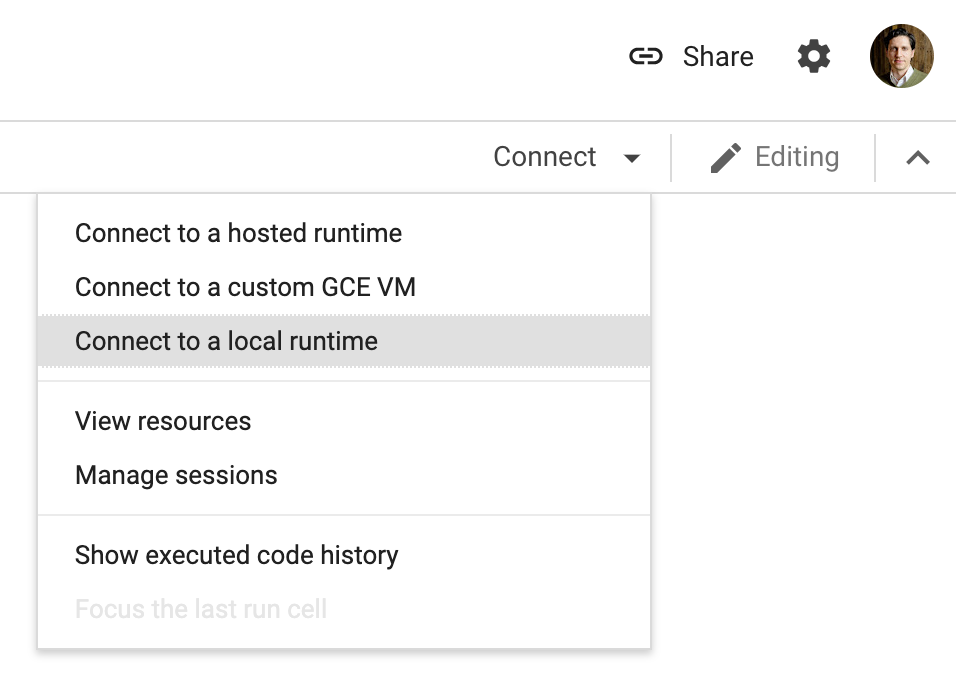
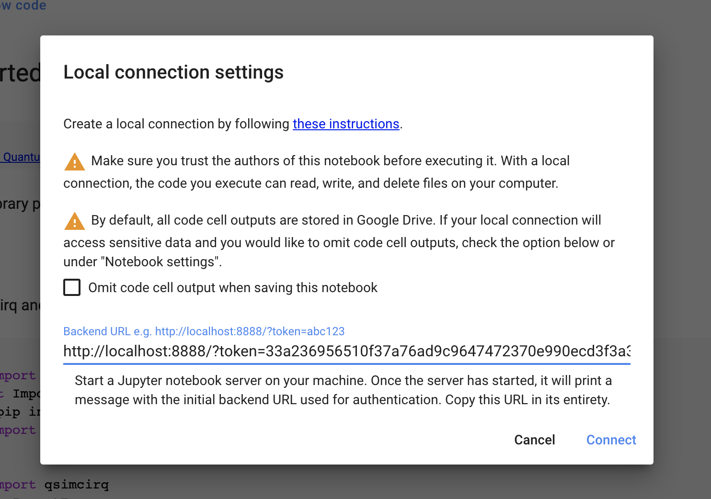
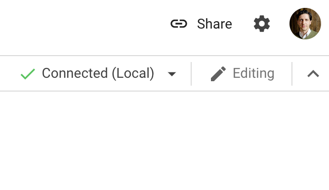

# CPU-based quantum simulation on Google Cloud

In this tutorial, you configure and test a virtual machine (VM) to run CPU-based
quantum simulations. The configuration in this tutorial uses the qsim Docker
container, running on a Google Compute Engine VM.

## 1. Create a virtual machine

Follow the instructions in the
[Quickstart using a Linux VM](https://cloud.google.com/compute/docs/quickstart-linux)
guide to create a VM. In addition to the guidance under the Create a Linux VM
instance heading, ensure that your VM has the following properties:

*   In the **Machine Configuration** section:
    1. Select the tab for the **Compute Optimized** machine family.
    2. In the machine **Series** option, choose **C2**.
    3. In the **Machine type** option, choose **c2-standard-16**. This option
       gives you 16 virtual CPUS and 64MB of RAM.
       Note: This choice is for demonstration purposes only. For a live
       experiment, see [Choosing hardware for your qsim
       simulation](/qsim/choose_hw).
*   In the **Boot disk section**, click the **Change** button, and choose
    **Container-Optimized** operating system. This overrides the seletion in
    step 3 in [Create a Linux VM
    instance](https://cloud.google.com/compute/docs/quickstart-linux#create_a_linux_vm_instance).
*   In the **Firewall** section, ensure that both the **Allow HTTP traffic**
    checkbox and the **Allow HTTPS traffic** checkbox are selected.

When Google Cloud finishes creating the VM, you can see your VM listed in the
[Compute Instances dashboard](https://pantheon.corp.google.com/compute/instances)
for your project.

### Find out more
* [Choosing the right machine family and
  type](https://cloud.google.com/blog/products/compute/choose-the-right-google-compute-engine-machine-type-for-you)
* [Container-Optimized OS
  Overview](https://cloud.google.com/container-optimized-os/docs/concepts/features-and-benefits)

## 2. Prepare your computer

Use SSH to create an encrypted tunnel from your computer to your VM and redirect
a local port to your VM over the tunnel.

1.  Install the `gcloud` command line tool. Follow the instructions in the
    [Installing Cloud SDK](https://cloud.google.com/sdk/docs/install)
    documentation.
2.  After installation, run the `gcloud init` command to initialize the Google
    Cloud environment. You need to provide the `gcloud` tool with details
    about your VM, such as the project name and the region where your VM is
    located.
    1.  You can verify your environment by using the `gcloud config list`
        command.
3.  Create an SSH tunnel and redirect a local port to use the tunnel by typing
    the following command in a terminal window on your computer. Replace
    `[YOUR_INSTANCE_NAME]` with the name of your VM.

    ```
    gcloud compute ssh [YOUR_INSTANCE_NAME] -- -L 8888:localhost:8888
    ```

When the command completes successfully, your prompt changes from your local
machine to your virtual machine.

## 3. Start the qsim Docker container on your virtual machine

1.  On the VM that you just created, start the qsim container:

    ```
    docker run -v `pwd`:/homedir -p 8888:8888 gcr.io/quantum-builds/github.com/quantumlib/jupyter_qsim:latest &
    ```

    If you see a `permission denied` error message, you might need to add `sudo`
    before your Docker command. For more information about running Docker, see the
    [`docker run` command reference](https://docs.docker.com/engine/reference/run/#general-form).

2.  Verify the output from Docker when as it downloads and starts the container.
    The last few lines should be similar to the following output:

    ```
    To access the notebook, open this file in a browser:
        file:///root/.local/share/jupyter/runtime/nbserver-1-open.html
    Or copy and paste one of these URLs:
        http://e1f7a7cca9fa:8888/?token=aa16e1b6d3f51c58928037d34cc6854dac47347dd4c0eae5
        or http://127.0.0.1:8888/?token=aa16e1b6d3f51c58928037d34cc6854dac47347dd4c0eae5
    ```

3.  Copy the URL in the last line of output from your console, and save it for
    the next task.

## 4. Connect to your virtual machine

The easiest way to use your VM is through a notebook environment like
[Google Colaboratory](https://colab.sandbox.google.com/notebooks/intro.ipynb?utm_source=scs-index#recent=true)
(Colab). Google Colab is a free, hosted notebook environment that enables you to
write, execute, and share Python code from your browser.

However, the qsim Docker image also includes a Jupyter kernel and other
command-line tools. These tools enable you to connect directly to your container
and run your code.

*   {Colab}

      You can write code in a Colab notebook, and use your VM to run your code. In
      this scenario, we use the
      [Get Started with qsimcirq Colab notebook](https://quantumai.google/qsim/tutorials/qsimcirq).

      1.  Open the
          [Get Started with qsimcirq notebook](https://quantumai.google/qsim/tutorials/qsimcirq).
      2.  Click the **Connect** drop-down menu.
          the Connect button to open the menu.
      3.  Choose the **Connect to a local runtime** option to open the Local
          connection settings window.
          
      4.  In the **Backend URL** text field, paste the URL that you saved in
          [task 3](#3_start_the_qsim_docker_container_on_your_virtual_machine).
      5.  Change the part of your URL that read `127.0.0.1` to `localhost`.
          
      6.  Click the **Connect** button in the Local connection settings window.

      When your connection is ready, Colab displays a green checkmark beside the
      Connected (Local) drop-down menu.

      

      The code cells in your notebook now execute on your VM instead of your local
      computer.

*   {Jupyter}

      You can run your simulation directly in your Docker container, in Jupyter.
      Jupyter runs in the qsim Docker container.

      1.  Open a browser window.
      2.  In the navigation bar, paste the URL that you copied in [task
          3](#3_start_the_qsim_docker_container_on_your_virtual_machine).
      3.  In the browser you should now see the Jupyter UI, running on your VM.

      The code that you execute here executes on your VM. You can navigate to qsim >
      docs > tutorials to try other tutorials.

*   {Command line}

      You can run a quantum simulation using qsim from the command line.
      Your code runs in the qsim Docker container.

      **Before you begin**

      For this scenario, you can connect to your machine directly over SSH
      rather than create a tunnel. In [task 2, step 3](#2_prepare_your_computer)
      above, remove the second half of the command.  Instead of this command:

      ```
      gcloud compute ssh [YOUR_INSTANCE_NAME] -- -L 8888:localhost:8888
      ```

      Run:

      ```
      gcloud compute ssh [YOUR_INSTANCE_NAME]
      ```

      Either command works for the purpose of this tutorial. Continue to task 4 then
      complete the steps below, regardless of which command you use.

      **1. Copy the container ID for your qsim Docker container**

      Run `docker ps` to display the container ID. The output should look like
      the following text:

      ```
      CONTAINER ID IMAGE COMMAND CREATED STATUS PORTS NAMES i
      8ab217d640a3 gcr.io/quantum-291919/jupyter_qsim:latest "jupyter-notebook --…" 2 hours ago Up 2 hours 0.0.0.0:8888->8888/tcp dazzling_lovelace.
      ```

      In this case, the container ID is `8ab217d640a3`.

      **2. Connect to your qsim Docker container**

      Run `docker exec` to login to your container. Replace `[CONTAINER_ID]`
      with the ID that you copied in step 1.

      ```
      docker exec -it [CONTAINER_ID] /bin/bash
      ```

      Your command prompt now executes commands in the container.

      **3. Verify your installation**

      You can use the code below to verify that qsim uses your qsim installation.
      You can paste the code directly into the REPL, or paste the code in a
      file.

      ```
      # Import Cirq and qsim
      import cirq
      import qsimcirq

      # Instantiate qubits and create a circuit
      q0, q1 = cirq.LineQubit.range(2)
      circuit = cirq.Circuit(cirq.H(q0), cirq.CX(q0, q1))

      # Instantiate a simulator that uses the GPU
      qsim_simulator = qsimcirq.QSimSimulator()

      # Run the simulation
      print("Running simulation for the following circuit:")
      print(circuit)

      qsim_results = qsim_simulator.compute_amplitudes(
          circuit, bitstrings=[0b00, 0b01])

      print("qsim results:")
      print(qsim_results)
      ```

      After a moment, you should see a result that looks similar to the following.

      ```
      [(0.7071067690849304+0j), 0j]
      ```

## Next steps

After you finish, don't forget to stop or delete your VM on the Compute
Instances dashboard to prevent further billing.

You are now ready to run your own large simulations on Google Cloud. If you want
to try a large circuit on Google Cloud, you can connect the
[Simulate a large quantum circuit](https://colab.sandbox.google.com/github/quantumlib/qsim/blob/master/docs/tutorials/q32d14.ipynb)
Colab notebook to your VM
([documentation](https://quantumai.google/qsim/tutorials/q32d14)).

For more information about managing your VM, see the following documentation
from Google Cloud:

*   [Stopping and starting a VM](https://cloud.google.com/compute/docs/instances/stop-start-instance)
*   [Suspending and resuming an instance](https://cloud.google.com/compute/docs/instances/suspend-resume-instance)
*   [Deleting a VM instance](https://cloud.google.com/compute/docs/instances/deleting-instance)

As an alternative to Google Cloud, you can download the Docker container or the
qsim source code to run quantum simulations on your own high-performance
computing platform.
