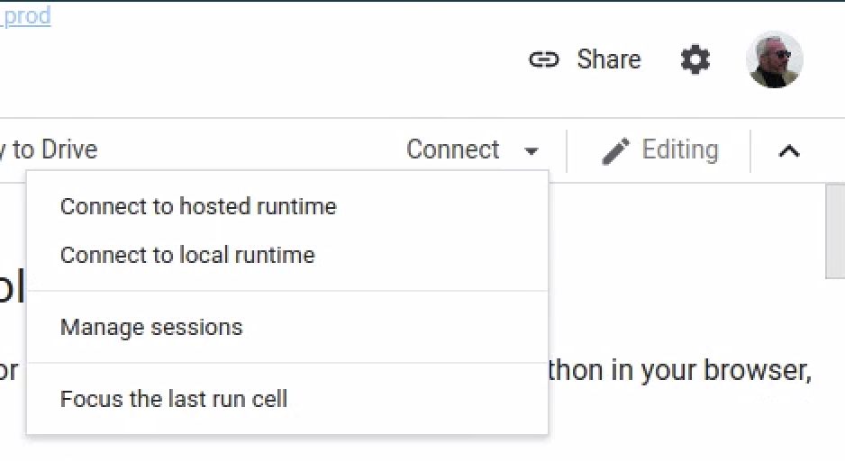
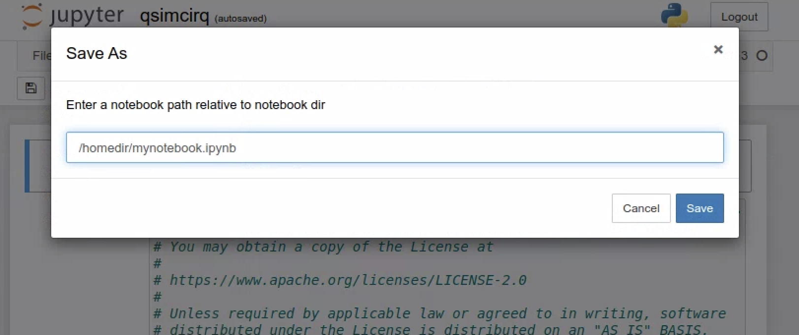

# Quantum simulation on GCP with _Cirq_ and _qsim_

This tutorial will demonstrate how to run [Cirq](https://cirq.readthedocs.io/en/latest/index.html) on Google Cloud Platform. This tutorial will walk through how to install Cirq within a Docker container on a GCE Virtual Machine and view results. You will run simulation both in a Jupyter environment and interactively within the container.

Explaining the concepts of quantum computing is beyond the scope of this tutorial, but many excellent references and texts exist. This website describes [Cirq](https://Cirq.readthedocs.io/en/stable/index.html) in detail. Additionally, the textbook *Quantum Computation and Quantum Information* by Nielsen and Chuang is an excellent reference.

## Objectives

*   Create a Container Optimized VM
*   Run Docker container with Jupyter and qsim installed
*   Run a demo circuit

## Costs

This tutorial uses billable components of Google Cloud Platform, including the *Compute Engine*. Use the [Pricing Calculator](https://cloud.google.com/products/calculator) to generate a cost estimate based on your projected usage.

## Before you begin

These are the steps to follow to get started with this tutorial:


*   Creating a Cloud Platform project
*   Enabling billing for the project
*   Enable Google Compute Engine API

For this reference guide, you need a Google Cloud [project](https://cloud.google.com/resource-manager/docs/cloud-platform-resource-hierarchy#projects). You can create a new one, or select a project you already created:


1. Select or create a Google Cloud project.

> [GO TO THE PROJECT SELECTOR PAGE](https://console.cloud.google.com/projectselector2/home/dashboard)


2. Enable billing for your project.

> [ENABLE BILLING](https://support.google.com/cloud/answer/6293499#enable-billing)

When you finish this tutorial, you can avoid continued billing by deleting the resources you created. See [Cleaning up](#cleaning-up) for more detail.


## Creating a GCE VM 

Once you have a project enabled with a billing account, you will be able to create resources. The key resource required for this project is a Virtual Machine (VM) used to run the qsim quantum simulations. 


### Use the Cloud Console

Connect to the Cloud Console and make sure your current project is selected. Then click on "Create" for a new VM instance:


### Build a Container Optimized VM

To create the VM use the steps in sequence below:


*   Change the name of the VM to be something meaningful like "qsim-1".
*   Choose a Region and Zone
    *   The values are not too important now, but for latency and availability [you may make different choice](https://cloud.google.com/compute/docs/regions-zones#available).
*   Choose the machine family / series: N2
    *   Quantum simulation can require a high level of resources, so we are selecting powerful processors, but [many choices are available.](https://cloud.google.com/blog/products/compute/choose-the-right-google-compute-engine-machine-type-for-you)


*   Choose the [Machine Type](https://cloud.google.com/blog/products/compute/choose-the-right-google-compute-engine-machine-type-for-you): n2-standard-16
    *   16 CPUs
    *   64GB memory
*   Choose the Boot Disk image:[ Container-Optimized OS](https://cloud.google.com/container-optimized-os/docs/concepts/features-and-benefits)
    *   Leave the remaining as defaults.


Finally, enable HTTP access
*   Click "Create"


## Preparing your local system to connect to Colab
[Colaboratory](https://colab.sandbox.google.com/notebooks/intro.ipynb) or "Colab" for short, allows you to write and execute Python in your browser, with

* Zero configuration required
* Free access to GPUs
* Easy sharing

We will focus on how to run simulations GCE VM your created above using Colab as the UI / frontend.

### Install Gcloud on your local machine
In order to connnect your VM to Colab, you need to forward the default Jupyter port (8888) to your localhost. Port forwarding to a GCP VM requires that you have th Google Cloud Platform SDK installed on your local computer. This will give you access to the `gcloud` command.

Intallation instructions a be found [here](https://cloud.google.com/sdk/docs/install).

After installing, initialize the Google Cloud environment.

```bash
gcloud init
```
Respond to the prompts with your project ID and the zone where you created your VM. When completed, view the glcoud configuration:

```bash
gcloud config list
```
Output should look something like: 

```less
region = us-east4
zone = us-east4-c
[core]
account = wellhello@gargle.com
disable_usage_reporting = False
project = quantum-22222
```

## Connect via port forward to your VM
You are now ready co connect to your VM via a port forward gcloud command. Detailed instructions can be found [here](https://research.google.com/colaboratory/local-runtimes.html), but the following instructions should be sufficient to succeed. Connect up with SSH with port 8888 forwarded to your local machine:

```bash
gcloud compute ssh [YOUR_INSTANCE_NAME] -- -L 8888:localhost:8888
```
You should now see the command line prompt from your VM:
```bash
wellhello@qsim-1 ~ $ 
```
### Run the Jupyter / qsim container on your VM 
At the command prompt you can now start a Docker container with all the required code to run simulations. Start the container:

```bash
docker run -v `pwd`:/homedir -p 8888:8888 gcr.io/quantum-builds/github.com/quantumlib/jupyter_qsim:latest
```
You should see several lines of output ending with lines like:
```less
    
    To access the notebook, open this file in a browser:
        file:///root/.local/share/jupyter/runtime/nbserver-1-open.html
    Or copy and paste one of these URLs:
        http://e1f7a7cca9fa:8888/?token=aa16e1b6d3f51c58928037d34cc6854dac47347dd4c0eae5
     or http://127.0.0.1:8888/?token=aa16e1b6d3f51c58928037d34cc6854dac47347dd4c0eae5

```
Copy the last URL  in the output. Edit the URL to replace `127.0.0.1` with `localhost`. Save this URL for the next step. This URL points to your local runtime, running as a Docker container on your VM.

## Connect Colab to your local runtime

First, get a notebook up and running on Colab.

 <a target="_blank" href="https://colab.research.google.com/github/quantumlib/qsim/blob/master/docs/tutorials/qsimcirq.ipynb">Run a qsim notebook.</a>

    
  If you are connect to Colab with a notebook visible, you can click on `Connect` to get the UI:



Select `Connect to local runtime`. You will see the UI:


This is where you past the edited URL from the previous section. Then click `Connect`


You should now be able to run the cells in the notebook.

### Large circuit
A large circuit is provided with 32 qubits and a depth of 14 gate operations.  Run it here:


<a target="_blank" href="https://colab.research.google.com/github/quantumlib/qsim/blob/master/docs/tutorials/qsimcirq.ipynb">Run q32d14.ipynb.</a>

This large circuit will not succeed if you attempt to run the default runtime. Ensure that you repeat the connection procedure to the local runtime.


## Optional: Connect to Jupyter directly

Once you have port 8888 forwarded and the container running on your GCE VM, it is easy to connect directly to Jupyter without using Colab.

In the previous step, you copied a URL like below. It is easy to just copy that URL and paste it directly into a browser running on your local machine.

```less
 http://127.0.0.1:8888/?token=7191178ae9aa4ebe1698b07bb67dea1d289cfd0e0b960373
```


 In the browser you should now see the Jupyter UI:


To see the notebooks, navigate to  qsim > docs > tutorials. You will see:


Click on qsimcirq.ipynb. This will load the notebook.

You can now run these cells as you would in any notebook.


If you choose to modify the notebook, you can save it on the *qsim-1* VM from *File* -> *Save As*, and saving to `/homedir/mynotebook.ipynb`.  This will save in your home directory on your VM. If you intend to destroy the VM after this tutorial, either download the notebooks from the VM or save directly from your browser.



## Run interactively

To run interactively within the container, you can open a second shell window to the VM as you did above, but without the port forwarding:

```bash
gcloud compute ssh [YOUR_VM_NAME]
```

Now, find the container ID with docker ps:

```
$ docker ps
```
You should see output something like:

```less
CONTAINER ID        IMAGE                                       COMMAND                  CREATED             STATUS              PORTS                    NAMES
8ab217d640a3        gcr.io/quantum-291919/jupyter_qsim:latest   "jupyter-notebook --…"   2 hours ago         Up 2 hours          0.0.0.0:8888->8888/tcp   dazzling_lovelace
```


The `CONTAINER_ID` is a UID something like "8ab217d640a3". Now you can connect to the container:
```console
    $ docker exec -it [CONTAINER_ID] /bin/bash

### Build the circuit

To import the libraries and build the circuit, copy and paste following into the VM window.


```python
    import cirq
    import qsimcirq

    # Pick a qubit.
    qubit = cirq.GridQubit(0, 0)

    # Create a circuit
    circuit = cirq.Circuit(
       cirq.X(qubit)**0.5,  # Square root of NOT.
    )
    print("Circuit:")
    print(circuit)
```


You should see the output as 

```less

(0, 0): ───X^0.5───

```


### Run the circuit

Now to see what the circuit does when under qsim. Again, copy the following into your VM window:


```python
    simulator = qsimcirq.QSimSimulator()
    result = simulator.simulate(circuit)
    print("Result:")
    print(result)
```


The output will be:


```less
    measurements: (no measurements)
    output vector: (0.5+0.5j)|0⟩ + (0.5-0.5j)|1⟩
```


You have successfully simulated a quantum circuit on Google Cloud Platform using a Singularity container.


### Running your own script

If you want to run a Python script, you can locate a file in the home directory on your VM, then run something like in the container shell

```bash
    $ python3 /homedir/myscript.py
```


### Exit the container

Exit the container by typing cntl-d twice. You will see the output like:


```less
    [root@79804d33f250 /]# exit
```


-----


## Cleaning up

To avoid incurring charges to your Google Cloud Platform account for the resources used in this tutorial:


### Delete the VM

It is usually recommended to delete the entire project you created for this tutorial, but if you want to continue using the project, you can easily either STOP the VM or Delete it. Select the VM, the either select the STOP square, or the DELETE trash can.


### Delete the project

The easiest way to eliminate billing is to delete the project you created for the tutorial.

**Caution**: Deleting a project has the following effects:

*   **Everything in the project is deleted.** If you used an existing project for this tutorial, when you delete it, you also delete any other work you've done in the project.
*   **Custom project IDs are lost.** When you created this project, you might have created a custom project ID that you want to use in the future. To preserve the URLs that use the project ID, such as an **```appspot.com```** URL, delete selected resources inside the project instead of deleting the whole project.

If you plan to explore multiple tutorials and quickstarts, reusing projects can help you avoid exceeding project quota limits.

1. In the Cloud Console, [go to the **Manage Resources** page](https://console.cloud.google.com/iam-admin/projects)
2. In the project list, select the project that you want to delete and then click **Delete** 


3. In the dialog, type the project ID and then click **Shut down** to delete the project.

----


## What's next

Additional tutorial examples are available here:


*   [Cirq examples](https://cirq.readthedocs.io/en/stable/examples.html)
*   [Getting started with qsimcirq](https://github.com/quantumlib/qsim/blob/master/docs/tutorials/qsimcirq.ipynb)

Try out other Google Cloud Platform features for yourself. Have a look at our [tutorials](https://cloud.google.com/docs/tutorials).
