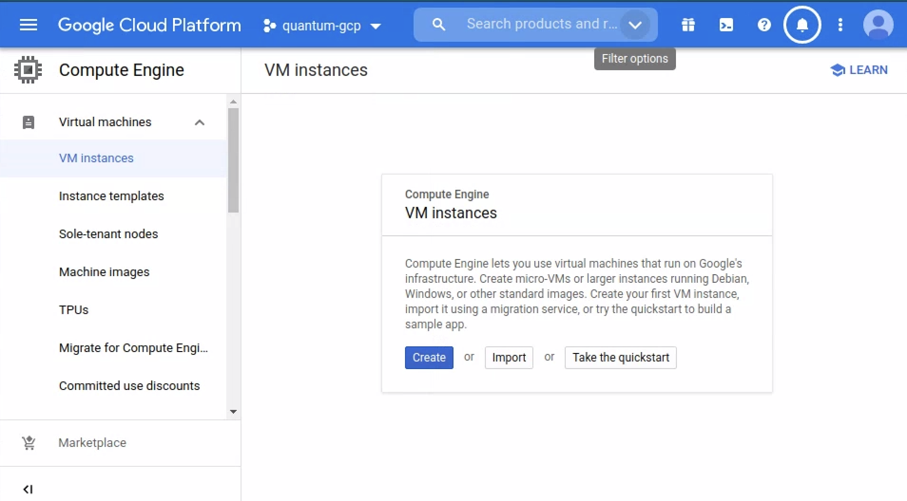
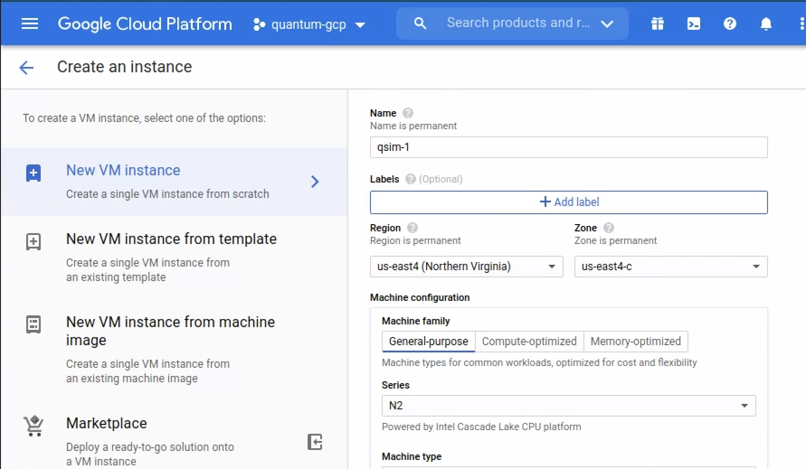
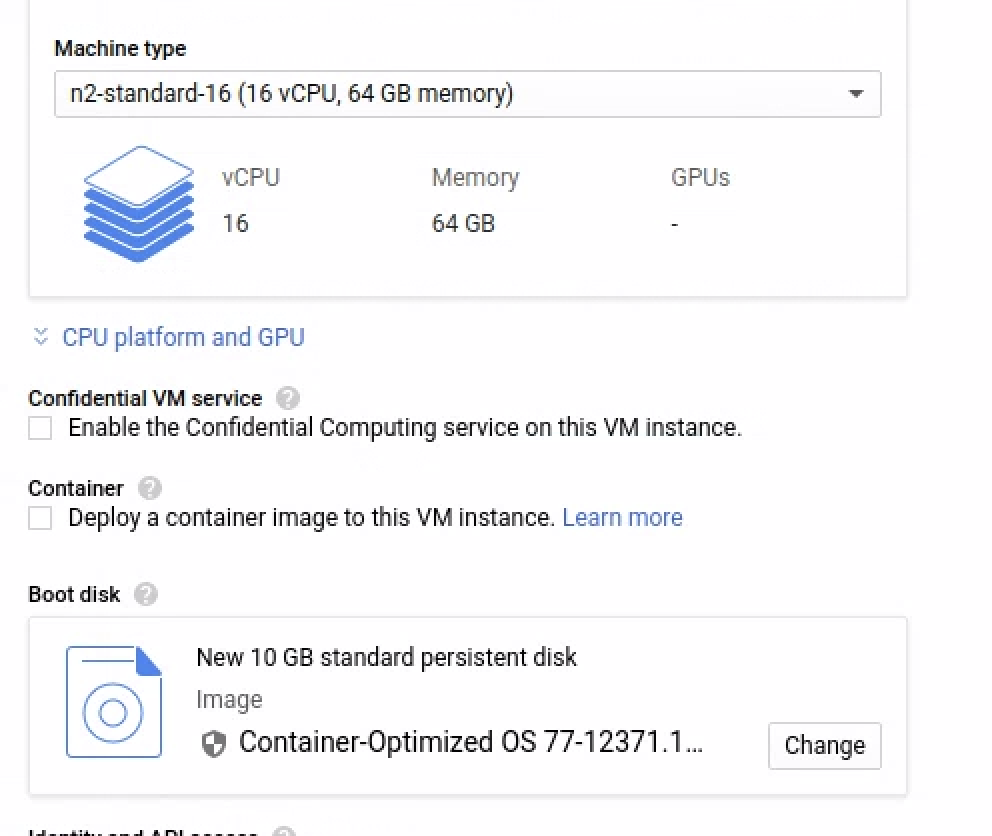
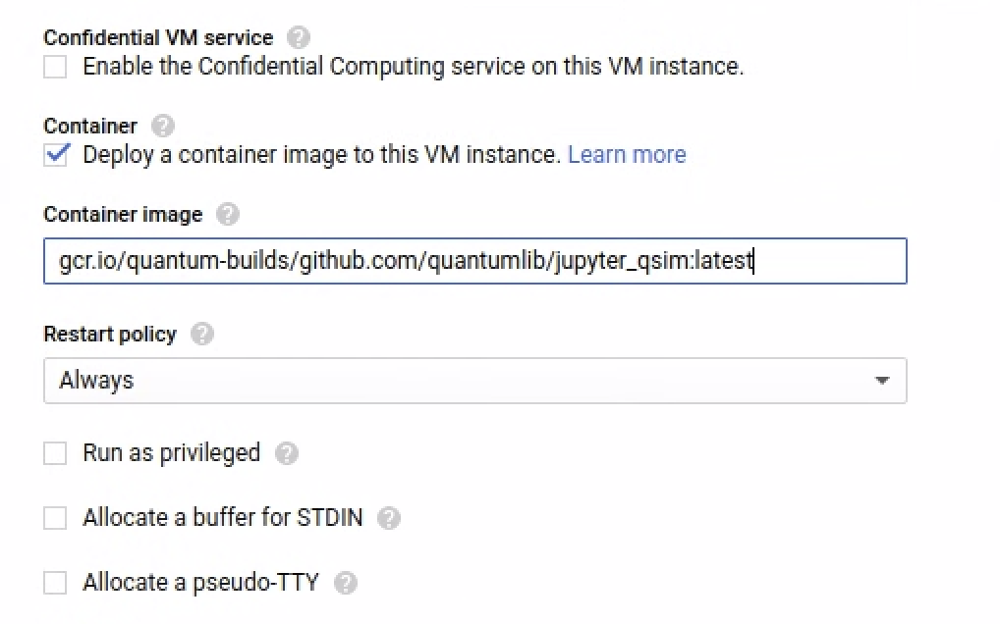
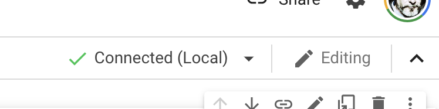
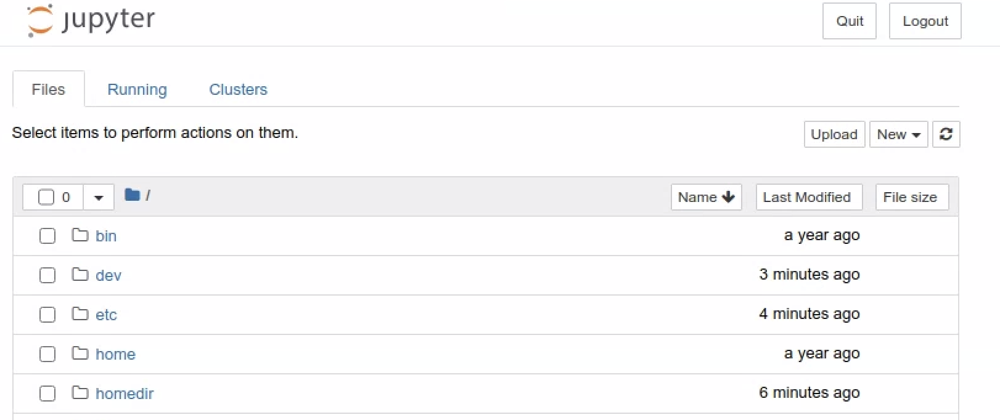
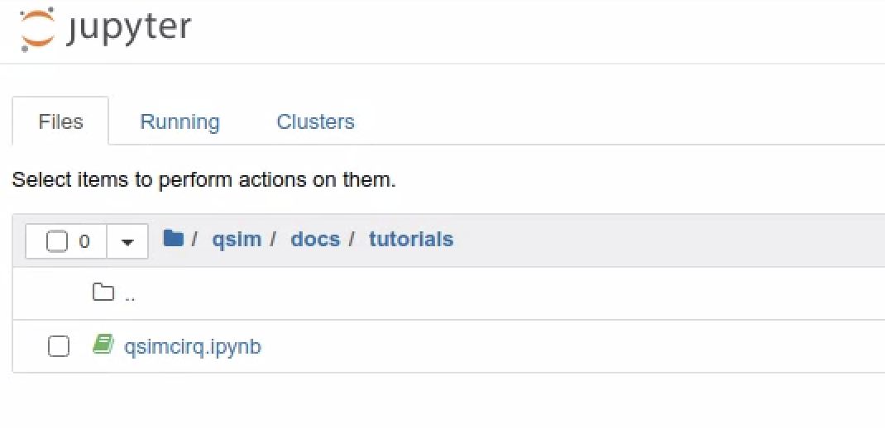
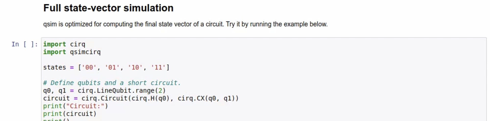

# Quantum simulation on GCP with Cirq and qsim

This tutorial demonstrates how to run Cirq on the Google Cloud Platform. It
shows how to install Cirq within a Docker container on a GCE Virtual Machine and
view the results. You will run the simulation in a Jupyter environment and
interactively within the container. In this tutorial you will:

*   Create a Container Optimized VM
*   Run Docker container with Jupyter and qsim installed
*   Run a demo circuit


## GCP setup

### Costs

This tutorial uses billable components of Google Cloud Platform, including the
*Compute Engine*. Use the
[Pricing Calculator](https://cloud.google.com/products/calculator) to generate a
cost estimate based on your projected usage.

### Before you begin

These are the steps to follow to get started with this tutorial:

*   Creating a Cloud Platform project
*   Enabling billing for the project
*   Enable Google Compute Engine API

For this reference guide, you need a
[Google Cloud project](https://cloud.google.com/resource-manager/docs/cloud-platform-resource-hierarchy#projects).
You can create a new one, or select a project you already created:

1. Select or create a Google Cloud project on the
   [project selector page](https://console.cloud.google.com/projectselector2/home/dashboard).
2. [Enable billing](https://support.google.com/cloud/answer/6293499#enable-billing)
   for your project.

After finishing this tutorial, you can avoid continued billing by deleting the
resources you created. See [Clean up](#clean-up) section below for details.


## Create a GCE VM

Once you have a project enabled with a billing account, you will be able to
create resources. The key resource required for this project is a Virtual
Machine (VM) used to run the qsim quantum simulations.

### Use the Cloud Console

Connect to the Cloud Console and make sure your current project is selected.
Then click on *Create* for a new VM instance:



### Build a Container Optimized VM with container deployed

To create the VM use the steps in sequence below:

*   Change the name of the VM to be something meaningful like "qsim-1".
*   Choose a Region and Zone
    * The values are not too important now, but for latency and availability you may
      [make a different choice](https://cloud.google.com/compute/docs/regions-zones#available).
*   Choose the machine family / series: N2
    * Quantum simulation requires powerful processors—the N2, N1, or C2 will work.
    * But if you have your own prefences, other
      [machine types](https://cloud.google.com/blog/products/compute/choose-the-right-google-compute-engine-machine-type-for-you)
      are available.



*   Choose the [Machine Type](https://cloud.google.com/blog/products/compute/choose-the-right-google-compute-engine-machine-type-for-you): n2-standard-16
    * 16 CPUs
    * 64GB memory
    * Leave the remaining as defaults.


> Select `Deploy a container image to this VM instance`.

For the container image enter:
```
gcr.io/quantum-builds/github.com/quantumlib/jupyter_qsim:latest
```

> This may take a few minutes to complete, even after the VM is created, the container will take some time to complete.


## Preparing your local system to connect to Colab

[Google Colab](https://colab.research.google.com/notebooks/intro.ipynb) allows
you to write and execute Python in your browser, with:

* Zero configuration required
* Free access to GPUs
* Easy sharing

This tutorial focuses on how to run simulations GCE VM your created above using
Colab as the UI / frontend.

### Install gcloud on your local machine

In order to connect your VM to Colab, you need to forward the default Jupyter
port (8888) to your localhost. Port forwarding to a GCP VM requires that you
have the Google Cloud Platform SDK installed on your local computer. This will
give you access to the `gcloud` command. See the
[Installing Google Cloud SDK](https://cloud.google.com/sdk/docs/install) guide.

After installing, initialize the Google Cloud environment:

```
$ gcloud init
```

Respond to the prompts with your project ID and the zone where you created your
VM. When completed, view the `gcloud` configuration:

```
$ gcloud config list
```

Output should look something like: 

```
region = us-east4
zone = us-east4-c
[core]
account = wellhello@gargle.com
disable_usage_reporting = False
project = quantum-22222
```


## Connect via port forward to your VM

You are now ready to connect to your VM through a port forward `gcloud` command.
Detailed instructions can be found in the
[Colab local runtimes guide](https://research.google.com/colaboratory/local-runtimes.html),
but the following instructions are sufficient to succeed. Connect up with SSH
with port 8888 forwarded to your local machine:

```
$ gcloud compute ssh [YOUR_INSTANCE_NAME] -- -L 8888:localhost:8888
```

You should now see the command line prompt from your VM:

```
wellhello@qsim-1 ~ $ 
```

The container port is now forwarded to your local machine.

## Connect Colab to your local runtime

First, get a notebook up and running on Colab. Open the
<a target="_blank" class="external" href="https://colab.research.google.com/github/quantumlib/qsim/blob/master/docs/tutorials/qsimcirq.ipynb">Get started with qsimcirq</a>
notebook in Colab.

If you are connect to Colab with a notebook visible, you can click *Connect* to
get the UI:


Select *Connect to local runtime*. You will see the UI:


Type in the URL `http://localhost:8888/` , then click *Connect*:



You should now be able to run the cells in the notebook.

### Large circuit

A large circuit is provided with 32 qubits and a depth of 14 gate operations.
Open the
<a target="_blank" class="external" href="https://colab.research.google.com/github/quantumlib/qsim/blob/master/docs/tutorials/q32d14.ipynb">Simulate large quantum circuit</a>
notebook in Colab.

This large circuit will not succeed if you attempt to run the default runtime.
Ensure that you repeat the connection procedure to the local runtime.


## Optional: Connect to Jupyter directly

Once you have port 8888 forwarded and the container running on your GCE VM, it
is easy to connect directly to Jupyter without using Colab.

In the previous step, you copied a URL like below. It is easy to just copy that
URL and paste it directly into a browser running on your local machine.

```
http://127.0.0.1:8888/
```

In the browser you should now see the Jupyter UI:



To see the notebooks, navigate to *qsim > docs > tutorials*. You will see:



Click on the `qsimcirq.ipynb` file. This will load the notebook.

You can now run these cells as you would in any notebook.



## Run interactively

To run interactively within the container, you can open a second shell window to
the VM as you did above, but without the port forwarding:

```
$ gcloud compute ssh [YOUR_VM_NAME]
```

Now, find the container ID with `docker ps` to see something like this:

```
$ docker ps

CONTAINER ID        IMAGE                                       COMMAND                  CREATED             STATUS              PORTS                    NAMES
8ab217d640a3        gcr.io/quantum-291919/jupyter_qsim:latest   "jupyter-notebook --…"   2 hours ago         Up 2 hours          0.0.0.0:8888->8888/tcp   dazzling_lovelace
```

The `CONTAINER_ID` is a UID something like "8ab217d640a3". Now you can connect to the container:

```
$ docker exec -it [CONTAINER_ID] /bin/bash
```

### Build the circuit

Run Python 3:

```
$ python3
```

To import the libraries and build the circuit, copy and paste following into the VM window.

<pre class="devsite-click-to-copy">
import cirq
import qsimcirq

qubit = cirq.GridQubit(0, 0)  # Pick a qubit.

# Create a circuit
circuit = cirq.Circuit(
    cirq.X(qubit)**0.5,  # Square root of NOT.
)
print("Circuit:")
print(circuit)
</pre>

You should see the output as 

```
(0, 0): ───X^0.5───
```

### Run the circuit

Now to see what the circuit does when under qsim. Again, copy the following into
your VM window:

<pre class="devsite-click-to-copy">
simulator = qsimcirq.QSimSimulator()
result = simulator.simulate(circuit)
print("Result:")
print(result)
</pre>


The output is:

```
measurements: (no measurements)
output vector: (0.5+0.5j)|0⟩ + (0.5-0.5j)|1⟩
```

You have successfully simulated a quantum circuit on Google Cloud Platform using
a Docker container.

## Clean up

To avoid incurring charges to your Google Cloud Platform account for the
resources used in this tutorial:

### Delete the VM

It is usually recommended to delete the entire project you created for this
tutorial, but if you want to continue using the project, you can easily either
STOP the VM or Delete it. Select the VM, the either select the STOP square, or
the DELETE trash can.


### Delete the project

The easiest way to eliminate billing is to delete the project you created for
the tutorial.

Be aware that deleting a project has the following effects:

- *Everything in the project is deleted.* If you used an existing project for
  this tutorial, when you delete it, you also delete any other work you've done
  in the project.
- *Custom project IDs are lost.* When you created this project, you might have
  created a custom project ID that you want to use in the future. To preserve
  the URLs that use the project ID, such as an `appspot.com` URL, delete
  selected resources inside the project instead of deleting the whole project.

If you plan to explore multiple tutorials and quickstarts, reusing projects can
help you avoid exceeding project quota limits.

1. In the Cloud Console, got to the
   [Manage Resources](https://console.cloud.google.com/iam-admin/projects) page.
2. In the project list, select the project that you want to delete and then
   click *Delete*. 
3. In the dialog, type the project ID and then click *Shut down* to delete the
   project.
